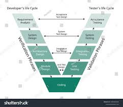
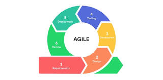

.. Team_TLC documentation master file, created by
   sphinx-quickstart on Mon Apr  7 19:19:59 2025.
   You can adapt this file completely to your liking, but it should at least
   contain the root `toctree` directive.

Welcome to Team_TLC's documentation!
====================================

**Team_TLC** (Thermal and LifeCycle) document is used to record results of architecture and design activities for Life Cycle Management (power control). 
The document contains high level and detailed design. It describes the behavior and how the SW interact with the remaining system.It also has a Separate Docupedia
page `GM VCU - Life Cycle Management <https://inside-docupedia.bosch.com/confluence/pages/viewpage.action?pageId=743609780>`_ and offers a *simple* and
*intuitive* API.

Check out the :doc:`bosch` section and :doc:`gmscope` section for further information, on how VIP AutoSAR handling in both the Bosch scope and GM scope.

1. This line is check *italics*
2. This line is being checked for **BoldFace**
3. and for Backquotes can be ``text`` for code example

.. note::

   This document is a work in progress. It is not yet complete and may be subject to change.

Images
-------

Check out the :doc:`image` section for further information.

Figure
------

   Software Development LC(Caption_a simple paragraph).

   The legend consists of all elements after the caption.  In this
   case, the legend consists of this paragraph and the following
   table:

   +-----------------------+-----------------------+
   | Symbol                | Meaning               |
   +=======================+=======================+
   | .. image:: tents.jpg  | Campground            |
   +-----------------------+-----------------------+
   | .. image:: waves.jpg  | Lake                  |
   +-----------------------+-----------------------+

Check out the :doc:`figure` section for further information.

Tables with Title
-----------------

.. table:: Truth table for "not"
   :widths: auto

   =====  =====
     A    not A
   =====  =====
   False  True
   True   False
   =====  =====

CSV Tables
----------

.. csv-table:: Frozen Delights!
   :header: "Treat", "Quantity", "Description"
   :widths: 15, 10, 30

   "Albatross", 2.99, "On a stick!"
   "Crunchy Frog", 1.49, "If we took the bones out,
   it wouldn't be crunchy, now would it?"
   "Gannet Ripple", 1.99, "On a stick!"

List Tables
-----------

.. list-table:: Frozen Delights!
   :widths: 15 10 30
   :header-rows: 1

   * - Treat
     - Quantity
     - Description
   * - Albatross
     - 2.99
     - On a stick!
   * - Crunchy Frog
     - 1.49
     - If we took the bones out, it wouldn't be
       crunchy, now would it?
   * - Gannet Ripple
     - 1.99
     - On a stick!
   

.. toctree::
   :maxdepth: 2
   :caption: Contents:

   bosch
   gmscope
   image
   figure

Indices and tables
==================

* :ref:`genindex`
* :ref:`modindex`
* :ref:`search`
